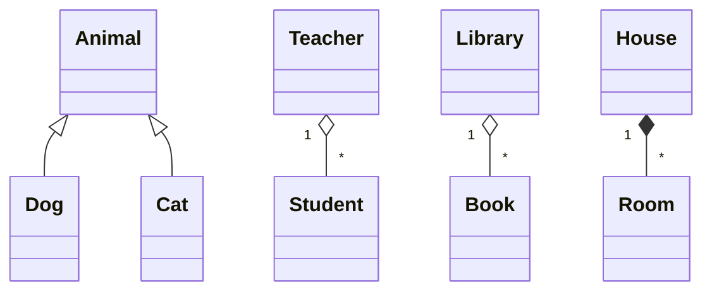

# OOD Interviews: Explain Inheritance vs. Relationships Like You Mean It

Vague answers fail in object-oriented design (OOD) interviews. Be precise, concise, and ready to defend your choices. Here's a compact, interview-ready way to explain inheritance vs. relationships so your answer is convincing and testable.

## 1) Say the basics clearly
- Class / Object: a blueprint vs an instance.
- Inheritance (is-a): one class is a subtype of another and inherits behavior/state.
- Relationships (has-a / uses): how objects connect at runtime.
  - Association (uses): loose link; one object calls methods on another.
  - Aggregation (has-a, independent lifetime): container/contained but each can exist independently (e.g., Library — Books).
  - Composition (has-a, dependent lifetime): part's lifecycle is tied to the whole (e.g., House — Rooms).

## 2) Give crisp examples (use them aloud)
- Inheritance: Animal -> Dog, Cat (Dog is-an Animal). Mention Liskov Substitution: if Dog can't be used wherever Animal is expected, inheritance is wrong.
- Association: Teacher ↔ Student (Teacher calls Student methods; both exist independently).
- Aggregation: Library has Books (books can exist outside the library).
- Composition: Car has Engine (engine's lifecycle tied to the Car in this model).

## 3) Draw it (UML tips to mention)
- Inheritance: solid line with hollow triangle toward the parent.
- Association: solid line; optionally annotate role and multiplicity (1, 0..*, *).
- Aggregation: open diamond at the container end.
- Composition: filled (black) diamond at the whole end.

Small Mermaid-style class diagram you can sketch quickly in interviews:

(If you can't draw, describe the arrows and multiplicities.)

## 4) State benefits, concisely
- Inheritance: code reuse, polymorphism, clear subtype relationships.
- Relationships (composition/aggregation/association): modularity, better encapsulation, easier changes and testing.

## 5) Expect follow-ups — be ready to defend and trade-off
- Why not inheritance? Overuse leads to brittle, deep hierarchies and incorrect type relationships.
- Why composition? Offers flexibility and decoupling; easier to swap implementations.
- Alternatives: interfaces/abstract classes, delegation, strategy pattern, dependency injection.
- Performance and memory: usually negligible—design clarity matters more.

When defending: point to semantics (is-a vs has-a), lifecycle, coupling, and substitution rules.

## 6) Quick interview checklist (say these aloud)
1. State the relationship type (is-a vs has-a vs uses).
2. Give a clear real-world example.
3. Draw or describe the UML with multiplicities.
4. Explain lifecycle/coupling implications.
5. List benefits and known trade-offs.
6. Offer an alternative (composition or interface) and why you might prefer it.

Keep answers concrete, use examples, and always tie the choice back to correctness (semantics), coupling, and testability. This structure shows clarity of thought and gives interviewers something tangible to follow up on.

#SoftwareEngineering #SystemDesign #CodingInterview